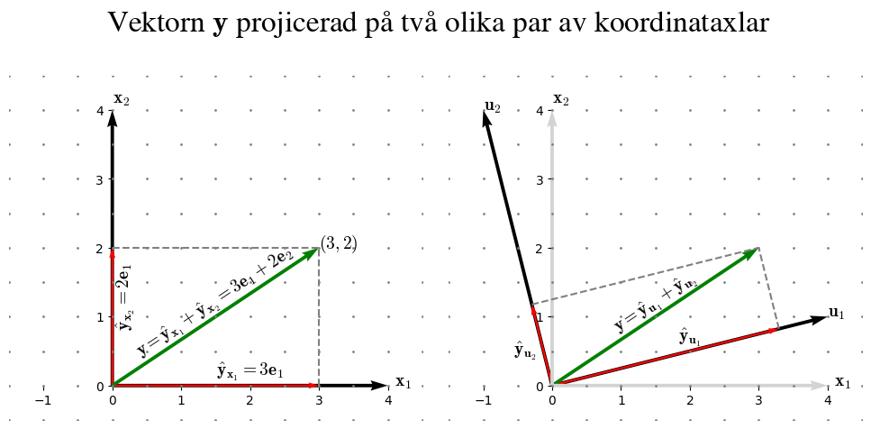
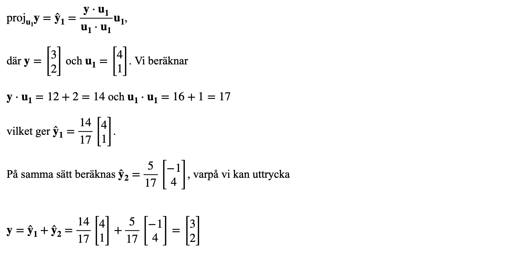

# Skalärprodukt och ortogonal projektion

Redan i kursen Fysik 1 har du komposantuppdelat krafer längs med koordinataxalarna. En begränsning med beräkningarna där var att koordinataxlarna skulle bygga upp det "vanliga" koordinatsystemet, dvs en horisontell x-axel och en vertikal y-axel.

I den linjära algebran så är koordinatsystemens möjligheter obegränsade. Axlarna behöver inte vara vinkelräta och de behöver inte peka horisontellt eller vertikalt. Vi ska titta på hur en och samma vektor projiceras på standardaxlarna respektive ett annat ortogonalt (vinkelrätt) axelpar.



Den här uppgiften handlar om att beräkna projektionen för en vektor på godtyckliga koordinataxlar som är ortogonala. Detta ska vi göra utifrån den s.k **skalärprodukten** av vektorer. Följande exempel bygger på den visade projektionen i figuren ovan.



Vi kom alltså tillbaka till samma vektor efter en utflykt med projektioner på andra koordinataxlar. Det som hände var att den grönmarkerade vektorn i bilden ovan delades upp i två komponenter, och att det visade sig att vektorn ifråga är summan av dessa komponenter. Den beskrivna metoden för komponentuppdelning medelst skalärprodukt gäller i de fall som komponenterna är ortogonala.

## Uppgifterna

Målet är att skapa ett program där du anger en vektor, motsvarande y-vektorn i exemplet ovan, och två koordinataxlar som vektorer av typen `ndarray`. Givet att koordinataxlarna är ortogonala ska programmet beräkna den ortogonala projektionen av vektorn y på respektive angiven koordinataxel. Ifall koordinataxlarna inte är ortogonala ska ett meddelande om detta skrivas ut (ingen beräkning sker i detta fall).

Eftersom formeln för att beräkna den ortogonala projektionen använder sig av skalärprodukt ska du börja med att skriva en funktion som tar emot två vektorer och returnerar deras skalära produkt.

### Test-exempel

_Kodskelettet nedan arbetar med samma data som räkneexemplet ovan._

```python
import numpy as np

def dot_product(vec_1, vec_2):
    '''
    Parametrar:
        vec_1: en vektor av typen ndarray
        vec_2: en vektor av typen ndarray
    Returvärde:
        Om vektorerna går att multiplicera skalärt:
            Skalärprodukten
        Om vektorerna inte går att multiplicera skalärt:
            None
    Övrigt: Denna funktion bygger inte på NumPy:s implementering
    av skalärprodukt.
    '''
    result = None
    # Implementera koden nedan

    return result

def is_orthogonal(koord_axlar):
    '''
    Parameter:
        koord_axlar: en matris av typen ndarray som
        definierar de båda koordinat-axlarnas riktning i kolonnerna
    Returvärde:
        Om ortogonala axlar: True
        Om ej ortogonala axlar: False
    '''
    result = False
    # Här sker kontrollen
    # som eventuellt ställer om variabeln result
    # ...
    return result

def calc_proj(vektor, koord_axlar):
    '''
    Parametrar:
        vektor: en vektor med två komponenter av typen ndarray
        koord_axlar: en matris av typen ndarray som definierar
        de båda koordinat-axlarnas riktning i kolonnerna
    Returvärde:
        En matris av typen ndarray som innehåller projektionen
        på respektive koordinataxel i kolonnerna
    '''
    result = np.zeros([2, 2])
    # Här sker själva beräkningen som lagrar
    # resultatet i variabeln result
    # ...
    return result

# Test-exempel
y = np.array([[3], [2]])
u1 = np.array([4, 1])
u2 = np.array([-1, 4])
u = np.array([u1.T, u2.T])
# Kontrollera hur y och u skrivs ut
# INNAN du börjar skriva funktionerna

### Ändra inget under denna rad
if is_orthogonal(u):
    proj = calc_proj(y, u)
    print(proj.round(2))
    # För en fungerande funktion och givna
    # data enligt räkneexemplet så skrivs ut:
    # [[3.29, -0.29],
    # [0.82, 1.18]]

    print("Längden på ovanstående projektionsvektorer:")
    norm_u1 = round(np.linalg.norm(proj[:, 0]), 2)
    norm_u2 = round(np.linalg.norm(proj[:, 1]), 2)
    print(f"||u1|| = {norm_u1}")  # Blir 3.4
    print(f"||u2|| = {norm_u2}")  # Blir 1.21
else:
    print("Angivna koordinataxlar är inte ortogonala.")
```

Du ska som sagt skriva en egen funktion för att beräkna skalärprodukten av två vektorer, `u` och `v`, men för orienteringens skull visar jag även hur man kan använda sig av funktionen `dot` som är definierad i `NumPy`:

```python
import numpy as np
u = np.array([1, 2, 3])
v = np.array([-2, 3, -4])
dot_product = np.dot(u, v)
print(dot_product) # Skriver ut -8
```
